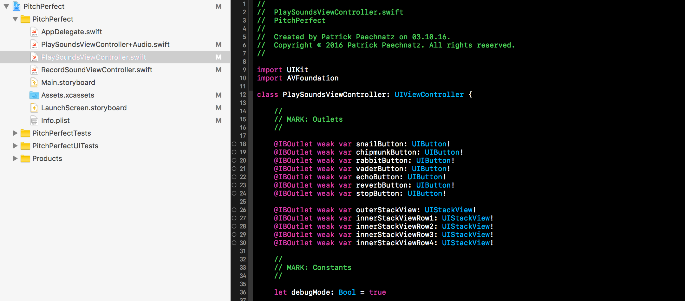
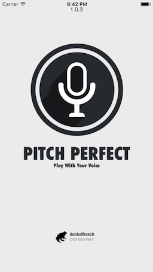
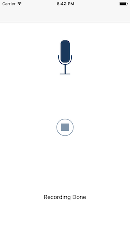
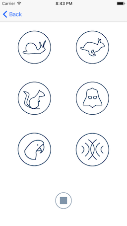

# PITCH-PERFECT
## udacity.com student submission

*This repository contains the project submission for udacity.com project work „PitchPerfect“ during my iOS developer certification program (course ND003).*

## App Description

This app records a conversation with you and a friend and plays it back to make you sound like a chipmunk or Darth Vader! Currently Six different Voice-Effects are supported.

## App Specifications

PitchPerfect master (currently 1.0.3) using the latest XCode 8.3 (8E162) version and will be able to run under iOS version 9.n up to the latest iOS version 10.n. PitchPerfect uses 3rd Party Libraries for better UX/UI behavior and graphical elements from vectorstock. A complete list of used libraries can be found inside the projects [COPYRIGHT.md](COPYRIGHT.md) file.

## App Features

PitchPerfect using a grid-based layout management to create a nice effect during switch from portrait to landscape mode.

## App Structure

PitchPerfect is following a very native/default structural definition, using different controller classes and corresponding extensions.

 

### SplashScreen / RecordView / VoiceSampler

Splash Screen             |  Record View               |  Sampler View
:-------------------------:|:-------------------------:|:-------------------------:
  |   |  

## Keywords
swift, swift-3, udacity, extension, uikit, AVFoundation, app

## Releases

PitchPerfect is currently available in [4 releases](https://github.com/paterik/udacity-ios-pitch-perfect/releases) and will be following the Sequence-based version pattern _major.minor[.maintenance[.build]]_. The build number won’t be part of my semantic versioning. 

## Changelog

All notable changes of the PitchPerfect release series are documented in project [CHANGELOG.md](CHANGELOG.md) file using the [Keep a CHANGELOG](http://keepachangelog.com/) prtheinciples. The changelog documentation starts with version 1.0.0 (2016-10-03).

## License-Term

Copyright (c) 2016-2017 Patrick Paechnatz <patrick.paechnatz@gmail.com>
                                                                           
Permission is hereby granted,  free of charge,  to any  person obtaining a copy of this software and associated documentation files (the "Software"), to deal in the Software without restriction,  including without limitation the rights to use,  copy, modify, merge, publish,  distribute, sublicense, and/or sell copies  of the  Software,  and to permit  persons to whom  the Software is furnished to do so, subject to the following conditions:       
                                                                           
The above copyright notice and this permission notice shall be included in all copies or substantial portions of the Software.
                                                                           
THE SOFTWARE IS PROVIDED "AS IS", WITHOUT WARRANTY OF ANY KIND, EXPRESS OR IMPLIED, INCLUDING  BUT NOT  LIMITED TO THE WARRANTIES OF MERCHANTABILITY, FITNESS FOR A PARTICULAR  PURPOSE AND  NONINFRINGEMENT.  IN NO EVENT SHALL THE AUTHORS OR COPYRIGHT HOLDERS BE LIABLE FOR ANY CLAIM, DAMAGES OR OTHER LIABILITY,  WHETHER IN AN ACTION OF CONTRACT,  TORT OR OTHERWISE,  ARISING FROM,  OUT OF  OR IN CONNECTION  WITH THE  SOFTWARE  OR THE  USE OR  OTHER DEALINGS IN THE SOFTWARE.